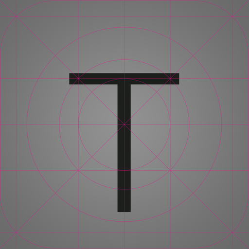

# Ruby Motion Template App

# Warning, this is not complete, I don't recommend basing any application off of it yet

This application can act as a jumpstart for a certain class of iOS applications. It includes:

 * A universal app (iPhone and iPad)
 * A splash screen
 * A slide out menu
 * [Pixate](http://www.pixate.com) for custom styling using CSS
 * [SASS](http://sass-lang.com) for managing your CSS styles
 * [TestFlight](https://testflightapp.com) for easily dpeloying your app to beta users

## Get Started

To get started, you can clone this repo and push it to your new repo.

```sh
mkdir -p ~/src/awesome-new-app
cd ~/src/awesome-new-app
git init .
git remote add template https://github.com/cpetersen/motion-template.git
git fetch template
git checkout -b master template/master
git create githubusername/awesome-new-app
git push origin master
```

Now update create a config with your custom variables, copy ```config.yml.example``` to ```config.yml```

```yaml
pixate_user: your-email@example.com # optional
pixate_key: your-pixate-key # optional
development:
  testflight_api_token: your-testflight-api-token 
  testflight_team_token: your-testflight-team-token
  provisioning_profile: path-to-your-mobileprovision-file # for example ./development.mobileprovision
release:
  provisioning_profile: path-to-your-mobileprovision-file # for example ./distribution.mobileprovision
```

## Images

iOS apps (particularly universal apps) must maintain a number of images for icons, app store icons and launch images. This template comes with place holder images, but it also comes with scripts for building all the necessary images from 2 source images.

### Launch Images

To create the necessary launch images:

1. Create a single 2048x2048 image called ```original.png``` in the ```resource``` directory.
2. ```cd``` to the ```resources``` directory
3. Run the ```create-launch-images.sh``` script.

That will create the following images:

 * Default-568h@2x.png
 * Default-Landscape@2x~ipad.png
 * Default-Landscape~ipad.png
 * Default.png
 * Default@2x.png
 * Default@2x~ipad.png
 * Default~ipad.png

 ### Icons

To create the necessary icons:

1. Create a single 1024x1024 image called ```iTunesArtwork@2x.png``` in the ```resource``` directory.
2. ```cd``` to the ```resources``` directory
3. Run the ```create-icons.sh``` script.

That will create the following images:

 * Icon-72.png
 * Icon-72@2x.png
 * Icon.png
 * Icon@2x.png
 * iTunesArtwork.png
 * iTunesArtwork@2x.png (your original)

### Default Icons



### Default SplashScreen


